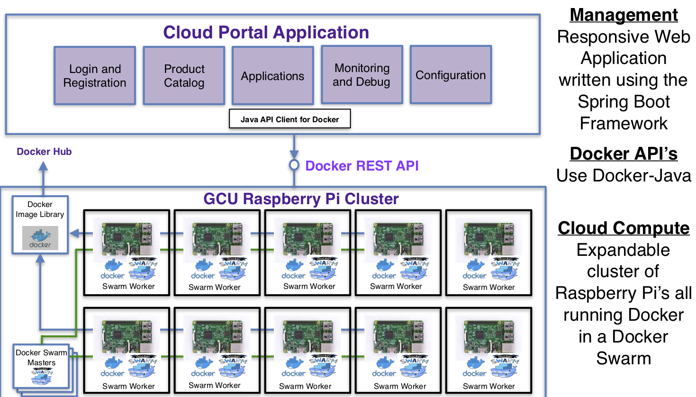

# GCU Cloud Platform - Research Project 2018-2019

Research Question: Can we design and build a fully functioning Private Cloud Platform using a cluster of Raspberry PI’s using current Cloud Technologies?

This repository contains the code to support the Cloud Portal Application and Java Docker API.

	

